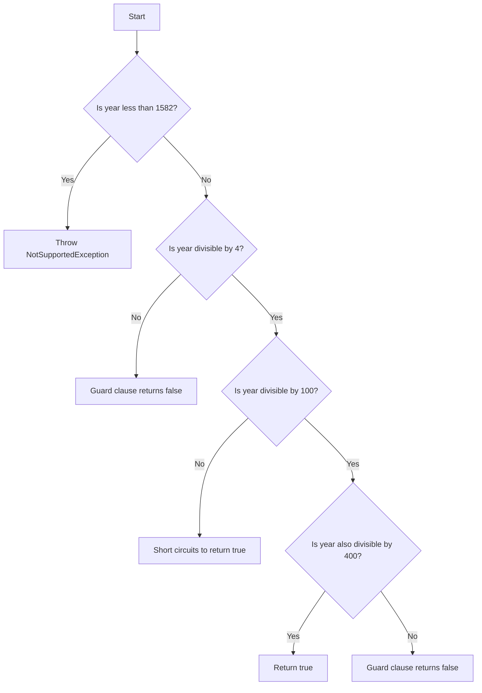

```mermaid
flowchart TD
    A[Start] --> B{Is year less than 1582?}
    B -- Yes --> C[Throw NotSupportedException]
    B -- No --> D{Is year divisible by 4?}
		D -- No --> E[Guard clause returns false]
		D -- Yes --> F{Is year divisible by 100?}
		F -- No --> I[Short circuits to return true]
		F -- Yes --> H{Is year also divisible by 400?}
		H -- Yes --> J[Return true]
		H -- No --> K[Guard clause returns false]
```
